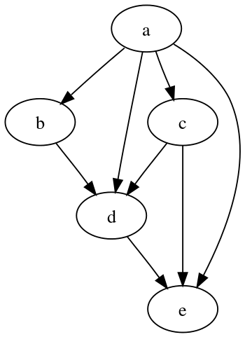
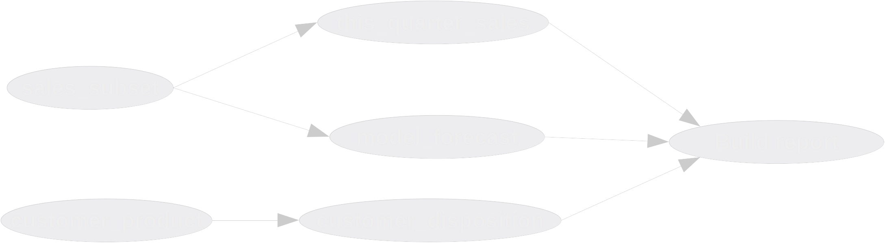

In data science and engineering we tend to think in "DAGs" (directed acyclic
graphs), which just means "to make this report, we first have to build this
other thing, and to build _that_ thing, we have to run these two queries, and so
on.  It decomposes the process of building data and artifacts like
visualizations or data exports into smaller, individual chunks.



There are a lot of contenders in the market for selling solutions to this exact
scenario, and each one solves it a little differently.  Right now the hot thing
is [dbt](https://docs.getdbt.com/tutorial/setting-up), but before that we had
airflow, dagster, prefect, argo, and a host of others that all were built to
operate DAGs at scale on different platforms. For large, mission-critical data
pipelines these can provide a lot of value, but the truth is that as data
scientists, most of us don't need something this heavy.  Most projects I see
really just need some way of defining the links between "scrapbook output".
Maybe it's a jupyter notebook, or a python script, or some queries that have to
happen in a particular order based on an updated warehouse feed.

Moreover, there are some reasons you might not want to try adding an entire
workflow management ecosystem into your stack.  Maybe:

* You can't get permission for a new install
* You don't want to force another install on your end users or coworkers
* You don't want more transitive dependencies entering the picture
* You don't like someone trying to sell their cloud solution on top of the free
  tier offering to you

`make` was born from a history of compiling C programs on Unix machines in the
70's, but it's completely agnostic to language choice. It's job is to translate
_targets_ and _prerequisites_ into a DAG, and incrementally build only the parts
it needs to when any of the source files change.  Given that, why would I choose
Make over one of the more modern alternatives?

* The commands are elegant - I enjoy the language of `make report.xlsx`
* Parallel execution is built in and easy to turn on or off
* It's installed on damn near everything,[^1] and has proven over the last 50
  years to be a shark, not a dinosaur
* It's a "small" program.  You can get through the [documentation][make-docs]
  and start creating useful software in a couple hours.
* Like SQL, Make is declarative. We describe the result, and let the program
  optimize the route by which we get there.


<br>
<br>


Creating a simple project with `make` and python
================================================

I'm going to use a distilled example of a recent project I built using just a
Makefile, some python, and a little SQL. By the end of this my hope is to show
that simple tools can be efficient and reliable, and avoid the overhead of
learning, installing, configuring, and inevitably debugging something more
complex.[^2] Ultimately, I wanted to hand this project off in such a way that
any of my teammates could maintain it if I was unavailable, so it had to be
short, and stick to the tools I know they will always have installed.

Our goal is to produce an Excel file for executive consumption that has a
meaningful summary of some data pulled out of our analytics warehouse.  Overall,
it'll look a little like this:

```
base queries --> summary CSVs --> (report.xlsx, diagrams for powerpoint)
```

The "base" queries might look a lot like temporary tables or common table
expressions (CTEs, or those blocks you see in `WITH` statements), but we've
broken them into several, separate queries.  We're plopping those summarized
results into some flat files so that we can examine the results with our
favorite tools like `pandas` or `awk`. We'll then take all those flat results
and produce deliverables from them, like charts and an excel file.

`myguy` is always there for me, so that's the name of our project, and its
basic structure looks like this:

```
.
├── config.yml
├── Makefile
├── myguy.py
├── README.md
└── sql
    ├── this_quarter_sales.sql
    ├── model_forecast.sql
    └── customer_disposition.sql
```

We will execute each file in the `sql/` directory as a query we execute and then
locally cache the results as CSVs.  Later we'll discuss how to handle the case
where all our queries are handled remotely, and don't create local files, such
as running `CREATE TABLE AS` (ctas) queries prior to building the report, but
for now we'll keep it simple: query --> csv on computer.

Our goal is to make reproducing this report dead simple.  I should only have to
run this command to rebuild the report at any time:

```sh
make report.xlsx
```

The cookbook that provides this _rule_ is the `Makefile`. 

```make
# Makefile
report.xlsx: myguy.py
	python -m myguy build-report
```

If this is your first time seeing make, there are a few terms to know:

* `report.xlsx` - this is the _target_ of the rule. It is the file produced by
  running `make report.xlsx`
* `myguy.py` - the _prerequisite_ of `report.xlsx`. It has to exist in order to
  create the excel file. If this python file's contents have changed recently,
  then that's an indication that `report.xlsx` may also change.
* `python -m myguy build-report` - this is the _recipe_ that Make runs when you
  issue the command `make report.xlsx`. I am invoking python with the `-m`, or
  "run module as main" flag in case we ever refactor our single .py file into a
  module, like `myguy/__init__.py` with its complementary "dunder main"
  `myguy/__main__.py`.

Our main entry point will be in the python module.  This will handle the program
runtime for executing queries or doing some pandas hackery.

```python3
# myguy.py
from pathlib import Path
from time import sleep

import click
import pandas as pd


@click.group()
def cli():
    pass


@cli.command()
@click.option(
    "-o",
    "--output",
    help="Write to file",
    default=f"{BUILD_DIR}/report.xlsx",
    show_default=True,
)
def build_report(output: str):
    """
    Generate a new Excel workbook and save it locally.
    """

    # Suppose this produces, you know, useful data
    pd.DataFrame(dict(a=range(3), b=list("abc"))).to_excel(output, index=False)
    sleep(2)

    print(f"Saved report to {output}")


if __name__ == "__main__":
    cli()
```

I think `click` is just great, and provides me with a lot of zen writing a
_command line interface_ (CLI) compared to `argparse`, although you could
achieve everything I'm doing in this article equally well with argparse.  In
this script we create a cli `group` because we'll eventually add more commands
to it.  The `build_report` function just replicates a process that takes a
couple seconds before it outputs a file to `build/report.xlsx`.

It takes very little code to get a pleasant command line experience with nested
commands. Here's a quick example of using it after adding another command called
`query`, which we'll get to in a moment:

<script id="asciicast-FtGlAzi0kBBbJm7JczQFflKWx" src="https://asciinema.org/a/FtGlAzi0kBBbJm7JczQFflKWx.js" async></script>

However, if we try building our report right now with `make report.xlsx`, we get
a `FileNotFoundError: [Errno 2] No such file or directory: 'build/report.xlsx'`,
and that's because we need to make sure the `build` directory exists before
running this command.  We could handle that in the python with a few lines, but
why not have our dependency management tool, `make`, do it for us?

```make
# Makefile
build:
	mkdir -p build

report.xlsx: myguy.py | build
	python -m myguy build-report
```

Now our `make report.xlsx` works just fine, and we get a new directory `build`
with our empty report in it. Normally we won't need the `|`, but in this case it
declares that the `build` rule should only be run once, even if we have other
targets with `build` as a prerequisite.[^3]  If we rerun `make report.xlsx`, it
doesn't try to create that directory again, because it already exists.

We do have one other problem though: if we re-run the python code, it will
overwrite our report, even if nothing has changed.  Instead, we should get a
message saying `make: 'report.xlsx' is up to date.`  This is happening because
our target is `report.xlsx` instead of `build/report.xlsx`, so `make` looks in
the current directory, sees that there's no `report.xlsx` and therefore runs the
recipe.  I don't want to write `make build/report.xlsx`, so what we'll do is set
up `make` to automatically look in our `build` and `sql` directories for files
by setting the [`VPATH` variable][search]:

```make
# Makefile
BUILDDIR := build
SQLDIR := sql
VPATH := $(SQLDIR):$(TARGETDIR)

$(BUILDDIR):
	mkdir -p $(BUILDDIR)

report.xlsx: myguy.py | $(BULDDIR)
	python -m myguy build-report
```

By doing this, we can just issue `make report.xlsx` instead of `make
build/report.xlsx`.  Setting `build` to a variable (referenced via
`$(BUILDDIR)`) allows us to change up the build directory on a whim, should we
need to.

Next, we need to structure the rules that handle our queries, so let's add a
generic method for doing exactly that, given the path to a sql file.

```python3
# myguy.py, cont.
from datetime import datetime

# ...other content same as before...

BUILD_DIR = "build"


@cli.command()
@click.argument("path")
def query(path: str):
    """
    Issue the query located at `path` to the database, and write the results to
    a similarly-named CSV in the `build` directory.

    \b
    Examples
    --------
    This command will produce a new file foobar.csv in the `myguy.BUILD_DIR` directory:

    $ python -m myguy query sql/foobar.sql
    """

    # Hey look, more fake code for an article about querying data
    sleep(2)

    destination = Path(BUILD_DIR) / Path(path).with_suffix(".csv").name
    (
        pd.DataFrame(
            dict(time_updated=[datetime.now()])
        )
        .to_csv(destination, index=False)
    )

    print(f"Finished query for {path} and wrote results to {destination}")
```

Again, imagine that the "sleep" we're doing here is some body of actual code
that fetches results from the database.  We also don't need `pandas` for
something as banal as touching a csv with today's date, but it's there to
replicate the very common use case of `pd.read_sql -> to_csv`, which is nearly
always the most efficient way to write a program that acquires a database
connection, queries it, and writes the results to a csv for analytics-scale work
in python like this.

We've also refactored out the
destination build directory into a variable, so we can have the make script grab
that automatically using the [`shell` built-in][shell]:

```make
# Makefile
BUILDDIR := $(shell python -c 'import myguy; print(myguy.BUILD_DIR)')
```

This technique is also useful for having builds that depend on things like
`myguy.__version__`, if it exists.  With the python in place, we need to set up
our recipes that run the queries. A naive first approach might look like this:

```make
# Makefile, cont.
# ... same as above ...

this_quarter_sales.csv: this_quarter_sales.sql
	python -m myguy query sql/this_quarter_sales.sql

model_forecast.csv: model_forecast.sql
	python -m myguy query sql/model_forecast.sql

customer_disposition.csv: customer_disposition.sql
	python -m myguy query sql/customer_disposition.sql
```

That's a lot of repetition, so our programmer instincts should kick in here and
tell us that "there must be a better way!"[^4].  Make can handle this using
[_implicit rules_][implicit-rules].  We specify a pattern like this, and Make
will do all the hard work of connecting the files together:

```make
%.csv: %.sql myguy.py | $(BUILDDIR)
	@python -m myguy query $<
```

This takes care of all three rules at once.

* The `%` is a wildcard - it matches anything and our rules here say that "if
  we're going to build a `.csv`, then it has a similarly-named `.sql` file as a
  prerequisite.
* The `@` at the start of the recipe suppresses echoing of the command when Make
  runs it
* The `$<` is an [automatic variable][automatic-variable] that stands for the
  first prerequisite. In our case, that will be the full path to the `.sql` file we
  are passing into the query function we previously wrote.
* Since `myguy.py` is the "source" of the running command, that's also a
  prerequisite
* the `| $(BUILDDIR)`, as before, says that we have an order-only prerequisite
  on the `build` directory, and our earlier rule will ensure `mkdir build` is
  run before trying to put output there

Now we can issue the same command as our report to build the CSV from each of
our queries:

```
$ make this_quarter_sales.csv
Finished query for sql/this_quarter_sales.sql and wrote results to build/this_quarter_sales.csv
```

We still need to tie all these together so that I don't have to run each command
manually - we want to just run `make report.xlsx` and have it do all the
prerequisite queries for us.  To accomplish this, we're going to use two more
built-ins, [`wildcard`][wildcard] and [`patsubst`][patsubst] to build the prerequisite and
target lists, respectively.

```make
SQLFILES := $(wildcard $(SQLDIR)/*.sql)
TARGETS := $(patsubst $(SQLDIR)/%.sql,%.csv,$(SQLFILES))
```

If we were to echo the contents of these two variables, they would look like
this:

```
# contents of SQLFILES
sql/customer_disposition.sql sql/model_forecast.sql sql/this_quarter_sales.sql

# contents of TARGETS
customer_disposition.csv model_forecast.csv this_quarter_sales.csv
```

Since our `report.xlsx` depends on all three of the files in `TARGETS`, we bind
them together in that rule:

```make
# Makefile

# ... other content same as before ...

report.xlsx: $(TARGETS)
	@python -m myguy build-report
```

Note here that we took out the `myguy.py` and `$(BUILDDIR)` prerequisites from
this rule, since those are coming from our implicit rule on the `$(TARGETS)`.
I'm also going to add a `clean` rule for trying things over from a fresh start:

```make
clean:
	@[ ! -d $(BUILDDIR) ] || rm -r $(BUILDDIR)
```

Decomposing this into English:

* `@` - don't echo this command when it runs. Just run it.
* `[ ! -d $(BUILDDIR) ] ||` - unless the BUILDDIR is missing, do the next
  command[^5]
* `rm -r $(BUILDDIR)` - remove the contents of the BUILDDIR recursively

Here's where our `Makefile` is now:

```make
# Makefile
BUILDDIR := $(shell python -c 'import myguy; print(myguy.BUILD_DIR)')
SQLDIR := sql
VPATH := $(SQLDIR):$(TARGETDIR)
SQLFILES := $(wildcard $(SQLDIR)/*.sql)
TARGETS := $(patsubst $(SQLDIR)/%.sql,%.csv,$(SQLFILES))

report.xlsx: $(TARGETS)
	@python -m myguy build-report

$(BUILDDIR):
	mkdir -p $(BUILDDIR)

%.csv: %.sql myguy.py | $(BUILDDIR)
	@python -m myguy query $<

clean:
	@[ ! -d $(BUILDDIR) ] || rm -r $(BUILDDIR)
```

So now we can run `clean` and build the report:

<script id="asciicast-k6BCaD1qgCjvmq157MUkOrd4d" src="https://asciinema.org/a/k6BCaD1qgCjvmq157MUkOrd4d.js" async></script>

We can do better though.  Make has parallelism built in, and most of our
computers have no trouble running things concurrently.  By providing
the `-j` (jobs) flag, we can tell it to do several things at once as long as
they don't depend on one another. Since our intermediate queries to CSV fit the
bill, they can all run at the same time:

<script id="asciicast-GznCov5dP98vCmtK223Xvoo6G" src="https://asciinema.org/a/GznCov5dP98vCmtK223Xvoo6G.js" async></script>

It's also possible to enable parallelism by default with the `MAKEFLAGS` special
variable.

```make
# Makefile
MAKEFLAGS := --jobs=$(shell nproc)
```

Adding dependencies between intermediate queries
================================================

Let's suppose we add two more queries, and they need to run before our existing
queries, because we did a little refactoring of our SQL.



Moreover, let's assume that these two new tables are too large to cache locally
in a flat file, and we have to issue a CREATE TABLE AS (ctas) statement to build
them first.  Not every database will permit you to run a CTAS on it, but imagine
this is any process that writes data remotely instead of locally, such as spark
writing a parquet file on S3, or submitting a POST request to an endpoint we
don't control.

We represent this in Make by first writing out the targets and prerequisites
with different suffixes.  For the remote tables, I'll use the '.ctas' suffix.  I
also like to do this in a separate file, `dag.mk`, so I can hop to its buffer
directly in my editor.

```make
# dag.mk
sales_subset.ctas:
customer_product.ctas:
this_quarter_sales.csv model_forecast.csv: sales_subset.ctas
customer_disposition.csv: customer_product.ctas
```

This arrangement forces the completion of `sales_subset.csv` and
`customer_product.csv` prior to the original three queries.  Then in the main
`MakeFile`, we include these contents above the rules that handle `.csv` files,
along with a new rule for handling the remote tables. The `%.ctas` rule will
create an _empty target_ as soon as the query is done, signaling to make when it
last completed successfully:

```
# Makefile
# ... other content the same ...
include dag.mk

%.csv: %.sql myguy.py | $(BUILDDIR)
	@python -m myguy query $<

%.ctas: %.sql myguy.py | $(BUILDDIR)
	@python -m myguy ctas $<
	@touch $(BUILDDIR)/$@
```

Note that this includes a new command for `myguy`, so let's add that too:

```python3
# myguy.py

@cli.command()
@click.argument("path")
def ctas(path: str):
    """
    Perform a CREATE TABLE AS statement from the SELECT statement in the given
    SQL file path.
    """
    sql_file = Path(path)
    query = f"CREATE TABLE {sql_file.stem} AS {sql_file.read_text()}"
    print(query)
    sleep(3)  # imagine the query is running
```

*** TODO could also do it via adding another directory under target for the csv queries*** 

And one last thing - our `$(TARGETS)` assignment has no way of
telling which sql files it should or shouldn't tie to CSVs.  The easiest way to
make this distinction is to actually just remove $(TARGETS) altogether, and have
the `dag.mk` declare what `report.xlsx` depends on.

```make
# dag.mk
# ...other contents the same...
report.xlsx: this_quarter_sales.csv \
	model_forecast.csv \
	customer_disposition.csv
```

```make
# Makefile

report.xlsx:
	@python -m myguy build-report
```

Make will take care of combining these two rules into a single one.  If all the
targets are going to have the same suffix, such as `.ctas` or `.csv`, then the
trick with `$(TARGETS)` is handy, but adds more complexity than it's worth when
mixing target file types.

Altogether, our dag now looks like this:

<script id="asciicast-kYzgUqw3qGKKKa9KbsUaz7hur" src="https://asciinema.org/a/kYzgUqw3qGKKKa9KbsUaz7hur.js" async></script>

<br>
<br>

Templating the SQL with Jinja
=============================

To round out some of our feature parity with dbt, we need to add templating
to our SQL.  It's best if I don't have to think about _how_ the template is
injected, I just want a standard place to put stuff and have the python module
take care of it.  Let's introduce a configuration file:

```
# config.yml
sales_max_date: "2022-03-01"
sales_min_date: "2021-09-01"
```

Presumably, a future analyst will have to come refresh this report for a
different set of dates, and we want that configuration readily available to
them.  The templating engine we'll use is the same on available on dbt,
Jinja2.  How we integrate it is by intercepting our python code that reads
queries and applying the template from the config there. The jinja2 part is a
little verbose, but flexible - anything that's in our config will be available
to the templated SQL:[^6]

```python3
# myguy.py
import yaml
import jinja2


# ... other content the same ...

BUILD_DIR = "build"
PROJECT_DIR = Path(__file__).parent


def get_config():

    with open(PROJECT_DIR / "config.yml") as f:
        config = yaml.safe_load(f)

    return config

# The `str | Path` union type hint is python 3.10 syntax, so watch out if you're
# on an older version!
def read_sql_text(path: str | Path) -> str:
    """
    Read a SQL file contents and apply jinja templating from this project's
    config.yml
    """

    config = get_config()
    jinja_loader = jinja2.FileSystemLoader(PROJECT_DIR)
    jinja_environment = jinja2.Environment(loader=jinja_loader)
    template = jinja_environment.get_template(str(path))
    sql = template.render(**config)

    return sql
```

And now we use this version of the sql in the `ctas` and `query` functions:

```python3
# myguy.py
# ...other content the same ...

def query(path: str):

    sql = read_sql_text(path)
    destination = Path(BUILD_DIR) / Path(path).with_suffix(".csv").name

    # Assuming you have some way of acquiring a database connection
    with get_connection() as conn:
        pd.read_sql(sql, conn).to_csv(destination)


def ctas(path: str):

    path = Path(path)
    sql = f"CREATE TABLE `{path.stem}` AS {read_sql_text(path)}"

    with get_connection() as conn:
        conn.execute(sql)
```

Within the SQL itself, we can now reference any of the keys in the `config.yml`
directly:

```sql
# sales_subset.sql
SELECT
    product_id
  , sales_revenue
  , sales_units
FROM
    fact_sales
WHERE
    sales_date BETWEEN date('{{ sales_min_date }}') AND date('{{ sales_max_date }}')
```

I'm not here to cover everything you can do with jinja and yaml, since those are
already pretty well covered. If you haven't used it before, it's worth looking
into. It's very powerful. The looping and conditional constructs can make what
would normally be pretty tough with just raw SQL easy.  When we issue a `make
recent_sales.ctas` command, it looks like this:

```
$ make sales_subset.ctas
mkdir -p build
CREATE TABLE `sales_subset` AS SELECT
    product_id
  , sales_revenue
  , sales_units
FROM
    fact_sales
WHERE
    sales_date BETWEEN date('2021-09-01') AND date('2022-03-01')
```

<br>
<br>

Conclusion
==========

There we have it, a simple little dag system for coordinating our project's
deliverables.  For a working example of how to implement this project structure,
check out the [companion repo][companion-repo], which builds a simple analysis
on the [chinook][chinook] dataset. This example also includes code that produces
`.png` files for including into presentations and migrates the `mypy.py` into a
fully-fledged, pip-installable module.


[^1]: Except Windows. You'll need to get it via mingw/cygwin or via the Windows
  subsystem for Linux.

[^2]: I fully acknowledge the irony here that `make` is, in fact, a very foreign
  tool to many data scientists.

[^3]: These are called [order-only prerequisites][prereq]

[^4]: I'm taking this phrase from Raymond Hettinger, who gives fantastic talks
  on writing idomatic python. I recommend his [beyond PEP8][raymond-better] talk
  to all levels of developers.

[^5]:  We do "unless" instead of the more familiar "if" statement, because
  if we did this: `[ -d $(BUILDDIR) ] && rm -r $(BUILDDIR)` the test command `[`
  exits with status 1 when the build directory doesn't exist, and hence the
  whole pipe exits status 1.  Make treats that as a failed recipe, which isn't
  what we intend.  We want it to look like a success both in the
  case of removing the directory should it exist, and doing nothing if it
  doesn't.

[^6]: You should be extremely careful about templating like this.  This article
  also uses f-strings for injecting arbitrary code into SQL, which is
  unacceptable if any of your system is public facing.  All of these examples
  are working under the assumption that we're in a locked-down internal data
  warehouse, and someone who has access to the system in _any_ way is allowed to
  issue an arbitrary query.

[make-docs]: <https://www.gnu.org/software/make/manual/html_node/Reading.html#Reading>
[prereq]: <https://www.gnu.org/software/make/manual/html_node/Prerequisite-Types> "GNU Make: Prerequisite Types"
[search]: <https://www.gnu.org/software/make/manual/html_node/General-Search.html> "GNU Make: General Search"
[shell]: <https://www.gnu.org/software/make/manual/html_node/Shell-Function.html> "GNU Make: Shell Function"
[raymond-better]: <https://www.youtube.com/watch?v=wf-BqAjZb8M> "Raymond Hettinger: Beyond PEP8"
[implicit-rules]: <https://www.gnu.org/software/make/manual/html_node/Pattern-Rules.html#Pattern-Rules> "GNU Make: Implicit Rules"
[automatic-variable]: <https://www.gnu.org/software/make/manual/html_node/Automatic-Variables.html> "GNU Make: Automatic Variables"
[wildcard]: <https://www.gnu.org/software/make/manual/html_node/Wildcard-Function.html> "GNU Make: Wildcard Function"
[patsubst]: <https://www.gnu.org/software/make/manual/html_node/Text-Functions.html> "GNU Make: Text Functions"
[chinook]: <https://github.com/lerocha/chinook-database> "Chinook on github"
[companion-repo]: <https://github.com/renzmann/chinook-make-dag>
