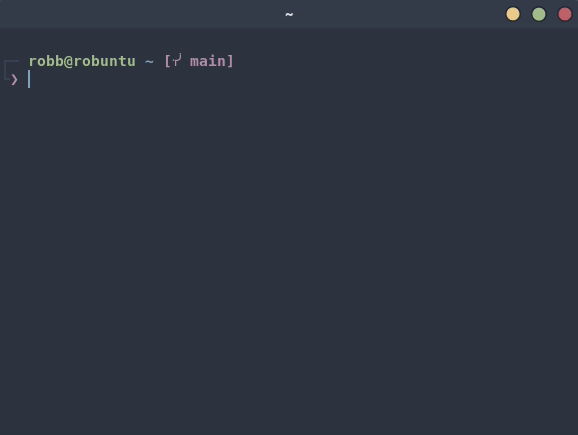

It took me a while to admit it, but with a little upfront time investment, the
command line is probably the fastest way to get _most_ tasks accomplished.  For
me, _most_ tasks means short, one-off, common file operations, such as:

1. Trying to find that one damn file that's nested **somewhere** down all those
   folders
1. Figuring out what version(s) of python I have installed, and making new
   virtual environments
1. Downloading files from a link and unzipping the results
1. Examining and editing the contents of a file

Can an IDE or VScode offer all this to me? Yup. Those tools are awesome, but
when I'm on the phone with someone, and they say "hey, can you pull up that one
thing real fast?" I don't have time to boot JetBrains, nor do I want to dig
through VScode menus.  I pop open the terminal, fuzzy search where I need to go,
and hit the file with `vim` if it's text or `open`[^1] if it's something like Excel
or PowerPoint.  The process of getting that file open from a cold start is
around 10 seconds.  Here's an example where I'm looking for a copy of the Python
logo:



`fzf` here indexed over a million files on my computer, but because I was able
to find it using just a few key words I knew were in the file path or name. 

Let's say it takes on average around 30 seconds to find a file
clicking through a file manager.[^2]  That's 20 seconds of savings per file.
Suppose we only look for around a dozen files like this per work day. Back
of napkin math tells us:

```
    20 seconds/file
  * 12 files/day
  *  5 days/wk
/ 3600 s/hr
-------------
     0.33 hours/wk
```

So assuming you work with roughly the numbers above, one hour of getting
comfortable with `fzf` will pay for itself in under three weeks.  Scale this
against the number of files you open, and how deeply nested down a mounted
SharePoint folder they might be, and the dividends are much faster.  If your
work looks anything like mine, you're sifting through at least several dozen
spreadsheets, presentations, and source code files every day, many of them with
similar names but with `v3.pptx` or `v_FINAL.xlsx` tacked on the end.

Does everyone need to use a fuzzy-finder to find and open files?  Certainly not.
Some Unix die-hards [abhor the use of fuzzy-finders][romainl_comment] in their
workflow, but I just can't seem to get a pure "unixy" way to work nearly as fast
as `ctrl+t` followed by slapping the keyboard with letters that _might_ be
somewhere in that file name.[^3]  I also don't think comments in the spirit of
the linked `/u/romainl` comment have the same set of assumptions about what a
"typical" data science setup looks like.  I haven't worked professionally as a
website developer, but I have a feeling we work in _very_ different
environments.  Often I'm sitting in front of a data warehouse I've never
connected to before, with 2,000 unique table names, each with possibly 200+
columns.  Usually the first thing I do is write a small `fzf` window that lets
me search columns or table names.  "Are there any features related to customer
age? Did an excel sheet from last month make it into the data lake?"
Interactive, visual feedback as I type these things, followed by a `ctrl+u` to
clear the search bar is _way_ faster than building a pipe with `find` and/or
`grep` and examining the results each time.

# Resources

1. [fzf installation instructions](https://github.com/junegunn/fzf#installation)
1. [kitty terminal](https://sw.kovidgoyal.net/kitty/) -- This is how I can `icat` an image in the terminal


[^1]: This is a macOS command.  On Windows, just type the name of the file.  For
  Linux I usually am on Gnome desktop, which uses `gio open`
[^2]: I'd love some actual hard numbers here, but I'd consider this a
  conservative estimate
[^3]: That said, `find . -name "whatever.csv"` is definitely still useful in a
  lot of cases

[romainl_comment]: <https://www.reddit.com/r/vim/comments/cp1upz/comment/ewnrslj/?utm_source=share&utm_medium=web2x&context=3>
[mental_game]: <https://youtu.be/UANN2Eu6ZnM?list=PLJHpE8rcAdmY-QUnKBOHgAy_0IEr-uMtF&t=341> "The Mental Game of Python - Raymond Hettinger"
