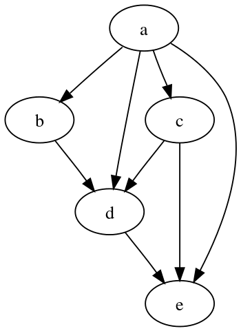

In data science we tend to think in "DAGs" (directed acyclic graphs), which just
means "to make this report, we first have to build this other thing, and to build
_that_ thing, we have to run these two queries, and so on.  It decomposes a system of
processing data and producing hard artifacts like visualizations or data exports
for others to consume.  



There are a lot of contenders in this space, and each one solves it a little
differently.  Right now the hot thing is
[dbt](https://docs.getdbt.com/tutorial/setting-up), but before that we had
airflow, dagster, prefect, and argo, just to name a few, that all were build to
operate DAGs at scale on different platforms. For large, mission-critical data
pipelines these can provide a lot of value, but the truth is that as data
scientists, most of us don't need something this heavy.  Most projects I see
really just need some way of defining the links between "scrapbook output".
Maybe it's a jupyter notebook, or a python script, or some queries that have to
happen in a particular order based on an updated warehouse feed.  dbt calls
itself the "data build tool," and that's basically what we need: a way to
compile project assets from the source code. Moreover, there are a host of
other reasons you might not want to try building a whole new tooling ecosystem
into your workflow.  Maybe:

* You can't get permission for a new install
* You don't want to force another install on your end users or coworkers
* You don't want more transitive dependencies entering the picture
* You don't like someone trying to sell their cloud solution on top of the free
  tier offering

`make` was born from a history of compiling C programs on Unix machines in the
70's, but it's completely agnostic to language choice. It's job is to translate
_targets_ and _prerequisites_ into a DAG, and incrementally build only the parts
it needs to when any of the source files change.  Given that, why would I choose
make over one of the more modern alternatives?

* The commands are very elegant - `make report.xlsx` is completely intuitive
* Parallel execution is built in and easy to turn on or off
* It's installed on damn near everything,[^1] and has proven over the last 50
  years to be a shark, not a dinosaur
* It's a "small" program.  You can get through the [documentation][make-docs]
  and start creating useful software in a couple hours.
* Like SQL, Make is declarative. We describe the result, and let the program
  optimize the route by which we get there. 


# Creating a simple DAG project with `make` and python

I'm going to use an example of a recent project I built using just a Makefile,
some python, and a little SQL that shows simple tools can be efficient and
reliable, without the overhead of learning, installing, configuring, and
inevitably debugging an unfamiliar tool.[^2]  Ultimately, I wanted to hand this
project off in such a way that any of my teammates could maintain it if I was
unavailable, so it has to be short, and stick to the tools I know they have
installed everywhere.

***TODO: emphasize importance of considering others***

Our goal is to produce an Excel file for executive consumption that has a
meaningful summary of some data pulled out of our analytics warehouse.  Overall,
it'll look a little like this:

```
base queries --> summary CSVs --> (report.xlsx, diagrams for powerpoint)
```

The "base" queries might look a lot like temporary tables or common table
expressions (CTEs, those blocks you see in `WITH` statements), but we've
broken them into several, separate queries so that we can debug them separately
if any underlying data has changed that affects one, but not the others.  We're
plopping those summarized results into some flat files so that we can examine
the results with our favorite tools like `pandas` or `awk`.  We'll then take all
those flat results and produce deliverables from them, like charts and an excel
file.

`myguy` is always there for me, so that's the name of our project, and its
basic structure looks like this:

```
.
├── config.yml
├── Makefile
├── myguy.py
├── README.md
└── sql
    ├── this_quarter_sales.sql
    ├── model_forecast.sql
    └── customer_disposition.sql
```

Each file in the `sql/` directory is a query we execute and then locally cache
the results.  Later we'll discuss how to handle the case where all our queries
are handled remotely, and don't create local files, such as running `CREATE
TABLE AS` (CTAS) queries prior to building the report, but for now we'll keep it
simple: query --> file on computer.

Our goal is to make reproducing this report dead simple.  I should only have to
run this command to rebuild the report at any time:

```sh
make report.xlsx
```

The cookbook that provides this _rule_ is the `Makefile`. 

```make
# Makefile
report.xlsx: myguy.py
	python -m myguy build-report
```

If this is your first time seeing make, there's a few terms to know:

* `report.xlsx` - this is the _target_ of the rule. It's the file that's
  produced by running `make report.xlsx`
* `myguy.py` - the _prerequisite_ of `report.xlsx`. It has to exist in order to
  create the excel file. If this python file's contents have changed recently,
  then that's an indication that `report.xlsx` will also change.
* `python -m myguy build-report` - this is the _recipe_ that make runs when you
  issue the command `make report.xlsx`. I am invoking python with the `-m`, or
  "run module as main" flag in case we ever refactor our single .py file into a
  module, like `myguy/__init__.py` with its complementary "dunder main"
  `myguy/__main__.py`.

In the python file, we need a few entry points, since it will handle our actual
runtime when we want to execute the queries or do some pandas hackery.

```python3
# myguy.py
from pathlib import Path
from time import sleep

import click


@click.group()
def cli():
    pass


@cli.command()
@click.option(
    "-o",
    "--output",
    help="Write to file",
    default=f"{BUILD_DIR}/report.xlsx",
    show_default=True,
)
def build_report(output: str):
    """
    Generate a new Excel workbook and save it locally.
    """
    sleep(2)
    destination = Path(output)
    destination.touch()
    print(f"Saved report to {destination}")


if __name__ == "__main__":
    cli()
```

I think `click` is just great, and provides me with a lot of zen writing a CLI
compared to `argparse`, although you could achieve everything I'm doing in this
article equally well with argparse.  In this script we create a cli `group`
because we'll eventually add more commands to it.  The `build_report` function
just replicates a process that takes a couple seconds before it outputs a file
to `build/report.xlsx`.  One reason I like click so much is because it takes
very little code to get a pleasant command line experience with nested commands.
Here's a quick example of using it after adding another command called `query`, which
we'll get to in a moment:

<script id="asciicast-FtGlAzi0kBBbJm7JczQFflKWx" src="https://asciinema.org/a/FtGlAzi0kBBbJm7JczQFflKWx.js" async></script>

However, if we try building our report right now with `make report.xlsx`, we get
a `FileNotFoundError: [Errno 2] No such file or directory: 'build/report.xlsx'`,
and that's because we need to make sure the `build` directory exists before
running this command.  We could handle that in the python with a few lines, but
why not have our dependency management tool, `make`, do it for us?

```make
# Makefile
build:
	mkdir -p build

report.xlsx: myguy.py | build
	python -m myguy build-report
```

Now our `make report.xlsx` works just fine, and we get a new directory `build`
with our empty report in it. Normally we won't need the `|`, but in this case it
declares that the `build` rule should only be run once, even if we have other
targets with `build` as a prerequisite.[^3]  If we rerun `make report.xlsx`, it
doesn't try to create that directory again, because it already exists.  We do
have one other problem though, and it's that even when the report exists, our
python code still runs.  Instead, we should get a message saying `make:
'report.xlsx' is up to date.`  This is happening because our rule doesn't say
`build/report.xlsx`, so `make` looks in the current directory, sees that there's
no `report.xlsx` and therefore runs the recipe.  I don't want to write `make
build/report.xlsx`, I much prefer our original way of issuing the command, so
what we'll do is set up `make` to automatically look in our `build` and `sql`
directories for files by setting the [`VPATH` variable][search]:

```make
# Makefile
BUILDDIR := build
SQLDIR := sql
VPATH := $(SQLDIR):$(TARGETDIR)

$(BUILDDIR):
	mkdir -p $(BUILDDIR)

report.xlsx: myguy.py | $(BULDDIR)
	python -m myguy build-report
```

By doing this, we can just issue `make report.xlsx` instead of `make
build/report.xlsx`.  Now we need to structure the rules that handle our queries.
First, let's add a generic method for issuing queries, given the path to a sql
file:

```python3
# myguy.py, cont.
# ...other content same as before...

BUILD_DIR = "build"


@cli.command()
@click.argument("path")
def query(path: str):
    """
    Issue the query located at `path` to the database, and write the results to
    a similarly-named CSV in the `build` directory.

    \b
    Examples
    --------
    This command will produce a new file foobar.csv in the `myguy.BUILD_DIR` directory:

    $ python -m myguy query sql/foobar.sql

    """
    sleep(2)
    destination = Path(BUILD_DIR) / Path(path).with_suffix(".csv").name
    destination.touch()
    print(f"Finished query for {path} and wrote results to {destination}")

```

Again, imagine that the "sleep" we're doing here is some body of actual code
you've written.  We've also refactored out the destination build directory into
a variable, so we can have the make script grab that automatically using the
[`shell` built-in][shell]:

```make
# Makefile
BUILDDIR := $(shell python -c 'import myguy; print(myguy.BUILD_DIR)')
```

This technique is also useful for having builds that depend on things like
`myguy.__version__`, if it exists.  With the python in place, we need to set up
our recipes that run the queries. A naive first approach might look like this:

```make
# Makefile, cont.
# ... same as above ...

this_quarter_sales.csv: this_quarter_sales.sql
	python -m myguy query sql/this_quarter_sales.sql

model_forecast.csv: model_forecast.sql
	python -m myguy query sql/model_forecast.sql

customer_disposition.csv: customer_disposition.sql
	python -m myguy query sql/customer_disposition.sql
```

That's a lot of repetition, so our programmer instincts should kick in here and
tell us that "there must be a better way!"[^4].  Make can handle this using
[_implicit rules_][implicit-rules].  We specify a pattern like this, and Make
will do all the hard work of connecting the files together:

```make
%.csv: %.sql myguy.py | $(BUILDDIR)
	@python -m myguy query $<
```

This takes care of all three rules at once.

* The `%` is a wildcard - it matches anything and our rules here say that "if
  we're going to build a `.csv`, then it has a similarly-named `.sql` file as a
  prerequisite.
* The `@` at the start of the recipe suppresses echoing of the command when Make
  runs it
* The `$<` is an [automatic variable][automatic-variable] that stands for the
  first prerequisite. In our case, that will be the full path to the `.sql` file we
  are passing into the query function we previously wrote.
* Since `myguy.py` is the "source" of the running command, that's also a
  prerequisite
* the `| $(BUILDDIR)`, as before, says that we have an order-only prerequisite
  on the `build` directory, and our earlier rule will ensure `mkdir build` is
  run before trying to put output there

Now we can issue the same command as our report to build the CSV from each of
our queries:

```
$ make this_quarter_sales.csv
python -m myguy query sql/this_quarter_sales.sql
Finished query for sql/this_quarter_sales.sql and wrote results to build/this_quarter_sales.csv
```

We still need to tie all these together so that I don't have to run each command
manually - we want to just run `make report.xlsx` and have it do all the
prerequisite queries for us.  To accomplish this, we're going to use two more
built-ins, [`wildcard`][wildcard] and [`patsubst`][patsubst] to build the prerequisite and
target lists, respectively.

```make
SQLFILES := $(wildcard $(SQLDIR)/*.sql)
TARGETS := $(patsubst $(SQLDIR)/%.sql,%.csv,$(SQLFILES))
```

If we were to echo the contents of these two variables, they would look like
this:

```
# contents of SQLFILES
sql/customer_disposition.sql sql/model_forecast.sql sql/this_quarter_sales.sql

# contents of TARGETS
customer_disposition.csv model_forecast.csv this_quarter_sales.csv
```

Since our `report.xlsx` depends on all three of the files in `TARGETS`, we tie
it together in that rule:

```make
# Makefile

# ... other content same as before ...

report.xlsx: $(TARGETS)
	@python -m myguy build-report
```

Note here that we took out the `myguy.py` and `$(BUILDDIR)` prerequisites from
this rule, since those are coming from our implicit rule on the `$(TARGETS)`.
I'm also going to add a `clean` rule for trying things over from a fresh start:

```make
clean:
	@[ ! -d $(BUILDDIR) ] || rm -r $(BUILDDIR)
```

Decomposing this into English:

* `@` - don't echo this command when it runs. Just run it.
* `[ ! -d $(BUILDDIR) ] ||` - unless the BUILDDIR is missing, do the next
  command[^5]
* `rm -r $(BUILDDIR)` - remove the contents of the BUILDDIR recursively

Here's where our `Makefile` is now:

```make
# Makefile
BUILDDIR := $(shell python -c 'import myguy; print(myguy.BUILD_DIR)')
SQLDIR := sql
VPATH := $(SQLDIR):$(TARGETDIR)
SQLFILES := $(wildcard $(SQLDIR)/*.sql)
TARGETS := $(patsubst $(SQLDIR)/%.sql,%.csv,$(SQLFILES))

report.xlsx: $(TARGETS)
	@python -m myguy build-report

$(BUILDDIR):
	mkdir -p $(BUILDDIR)

%.csv: %.sql myguy.py | $(BUILDDIR)
	@python -m myguy query $<

clean:
	@[ ! -d $(BUILDDIR) ] || rm -r $(BUILDDIR)
```

So now we can run `clean` and build the report:

<script id="asciicast-k6BCaD1qgCjvmq157MUkOrd4d" src="https://asciinema.org/a/k6BCaD1qgCjvmq157MUkOrd4d.js" async></script>

We can do better though.  Make has parallelism built in, and most of our
computers utilize multiple cores for running threads concurrently.  By providing
the `-j` (jobs) flag, we can tell it to do several things at once as long as
they don't depend on one another. Since our intermediate queries to CSV fit the
bill, they can all run at the same time:

<script id="asciicast-GznCov5dP98vCmtK223Xvoo6G" src="https://asciinema.org/a/GznCov5dP98vCmtK223Xvoo6G.js" async></script>

# Creating a DAG out of the intermediate queries

***TODO: setting up table dependencies with `include dag.mk`***

# Using empty targets for fully remote queries

***TODO: what if the processes are all remote? empty targets section***

***TODO: set up repo with finished code***

---

[^1]: Except Windows. You'll need to get it via mingw/cygwin or via the Windows
  subsystem for Linux.

[^2]: I fully acknowledge the irony here that `make` is, in fact, a very foreign
  tool to many data scientists.

[^3]: These are called [order-only prerequisites][prereq]

[^4]: I'm taking this phrase from Raymond Hettinger, who gives fantastic talks
  on writing idomatic python. I recommend his [beyond PEP8][raymond-better] talk
  to all levels of developers.

[^5]:  We do "unless" instead of the more familiar "if" statement, because
  if we did this: `[ -d $(BUILDDIR) ] && rm -r $(BUILDDIR)` the test command `[`
  exits with status 1 when the build directory doesn't exist, and hence the
  whole pipe exits status 1.  Make treats that as a failed recipe, which isn't
  what we intend.  We want it to look like a success both in the
  case of removing the directory should it exist, and doing nothing if it
  doesn't.

[make-docs]: <https://www.gnu.org/software/make/manual/html_node/Reading.html#Reading>
[prereq]: <https://www.gnu.org/software/make/manual/html_node/Prerequisite-Types> "GNU Make: Prerequisite Types"
[search]: <https://www.gnu.org/software/make/manual/html_node/General-Search.html> "GNU Make: General Search"
[shell]: <https://www.gnu.org/software/make/manual/html_node/Shell-Function.html> "GNU Make: Shell Function"
[raymond-better]: <https://www.youtube.com/watch?v=wf-BqAjZb8M> "Raymond Hettinger: Beyond PEP8"
[implicit-rules]: <https://www.gnu.org/software/make/manual/html_node/Pattern-Rules.html#Pattern-Rules> "GNU Make: Implicit Rules"
[automatic-variable]: <https://www.gnu.org/software/make/manual/html_node/Automatic-Variables.html> "GNU Make: Automatic Variables"
[wildcard]: <https://www.gnu.org/software/make/manual/html_node/Wildcard-Function.html> "GNU Make: Wildcard Function"
[patsubst]: <https://www.gnu.org/software/make/manual/html_node/Text-Functions.html> "GNU Make: Text Functions"
